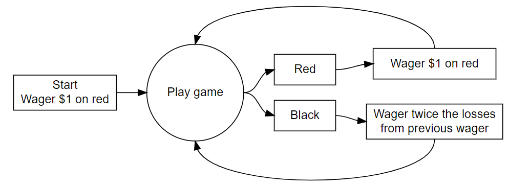

# Introduction

In this blog post, we explore Martingale's strategy and its viability through simulation and based on certain constraints applicable in a real world scenario(albeit with different parameter values depending on the setting).

# Background

A brief blurb about Roulette in General : 

A roulette table composed of 38 evenly sized pockets on a wheel. The pockets are colored red, black, or green. The pockets are also numbered. Roulette is a game of chance in which a pocket is randomly selected. Gamblers may wager on several aspects of the outcome. For example, one may place a wager that the randomly selected pocket will be red or odd numbered or will be a specific number. In our scenario, all one needs to know is that there are 38 pockets of which 2 are green, 18 are red, and 18 are black. The payout for a bet on black (or red) is $1 for each $1 wagered. This means that if a gambler bets $1 on black and the randomly selected pocket is black, then the gambler will get the original $1 wager and an additional $1 as winnings.

Here's a pictorial representation of Martingale's strategy. The Martingale strategy appears to always end in positive earnings, regardless of how unlucky a string of spins may be.



Constraints for the Simulation : 

__Stopping rule__


A player will use the above strategy and play until

* The player has W(Winning Threshold for Stopping) dollars
* The player goes bankrupt
* The player completes L wagers (or plays)

In this scenario W is 300$ (Starting Budget + Winnings) abd L is 1000 plays.


__Budget__


The player starts with B(Starting Budget B - 200$) dollars. The player cannot wager more money than he/she has.


__Maximum wager__


Some casinos have a maximum bet. Call this parameter M. If the strategy directs the player to wager more than M dollars, then the player will only wager M dollars(100$ in this scenario).


# Methods

The below chunks of code show the modular processes involved in simulation of the roulette game based on the above constraints. one_series() function is a culmination of the entire roulette spin which utilizes all the modular functions.


This chunk of code simulates a single spin of the roulette
```{r}
#Simulates Single Spin 
single_spin <- function(){
  possible_outcomes <- c(rep("red",18), rep("black",18), rep("green",2))
  sample(possible_outcomes, 1)
}
```

This chunk of code calculates the wager for the upcoming turn based on the previous wager as well as the previous outcome.
```{r}
#Simulates martingale wager
martingale_wager <- function(
  previous_wager
  , previous_outcome
  , max_wager
  , current_budget
){
  if(previous_outcome == "red") return(1)
  min(2*previous_wager, max_wager, current_budget)
}

```

This chunk of code simulates one turn of the roulette outputting specific parameters to be used as part of a series of spins
```{r}
#Simulates a single play/turn in a roulette game. 
one_play <- function(previous_ledger_entry, max_wager){
  # Create a copy of the input object that will become the output object
  out <- previous_ledger_entry
  out[1, "game_index"] <- previous_ledger_entry[1, "game_index"] + 1
  out[1, "starting_budget"] <- previous_ledger_entry[1, "ending_budget"]
  out[1, "wager"] <- martingale_wager(
    previous_wager = previous_ledger_entry[1, "wager"]
    , previous_outcome = previous_ledger_entry[1, "outcome"]
    , max_wager = max_wager
    , current_budget = out[1, "starting_budget"]
  )
  out[1, "outcome"] <- single_spin()
  out[1, "ending_budget"] <- out[1, "starting_budget"] + 
    ifelse(out[1, "outcome"] == "red", +1, -1)*out[1, "wager"]
  return(out)
}
```

This chunk of code establishes the stopping condition based on factors discussed above
```{r}
#Stopping Condition 
stopping_rule <- function(
  ledger_entry
  , winning_threshold
){
  ending_budget <- ledger_entry[1, "ending_budget"]
  if(ending_budget <= 0) return(TRUE)
  if(ending_budget >= winning_threshold) return(TRUE)
  FALSE
}
```

This chunk of code simulates the entire series of roulette spins until a certain stopping condition is achieved
```{r}
#Simulation of the entire roulette game.
one_series <- function(
  max_games, starting_budget, winning_threshold, max_wager
){
  # Initialize ledger
  ledger <- data.frame(
      game_index = 0:max_games
    , starting_budget = NA_integer_
    , wager = NA_integer_
    , outcome = NA_character_
    , ending_budget = NA_integer_
  )
  ledger[1, "wager"] <- 1
  ledger[1, "outcome"] <- "red"
  ledger[1, "ending_budget"] <- starting_budget
  for(i in 2:nrow(ledger)){
    ledger[i,] <- one_play(ledger[i-1,], max_wager)
    if(stopping_rule(ledger[i,], winning_threshold)) break
  }
  # Return non-empty portion of ledger
  ledger[2:i, ]
}
```

# Results
The below code chunk gives the profit over a full series of roulette spins which is a property of interest
```{r}
#Profit function given the entire series of plays.. 
profit <- function(ledger){
  n <- nrow(ledger)
  profit <- ledger[n, "ending_budget"] - ledger[1, "starting_budget"]
  return(profit)
}
```

```{r}
#All of the below function inputs are based on constraints described above
a <- one_series(1000,200,300,100)
a
profit(a)
```
The results are not always positive in the sense that the chances of winning and losing seem to be random and the Martingale strategy __under these constraints is not__ a guaranteed success. A specific observation is that a vast majority of profit results tend to be either -200 or 100. This is due to the either one of the stopping conditions being achieved - 1000 turns (extremely low chance of happening due to the small difference between starting amount and the winning threshold and the starting amount itself being low enough that 8-9 continuous losses would cause the player to lose the entire initial capital) or achieving the winning threshold or losing the initial capital/budget.

```{r}
library(magrittr)

svg(filename = "pattern.svg", width=16, height =8.25)
par(cex.axis=2.0, cex.lab = 2.5, mar = c(8,8,2,2), bg = rgb(222, 235, 247, max = 255))
#set.seed(1)
#Constraints chosen based on above stipulations.
ledger <- one_series(1000,200,300,100)
plot(ledger[,c(1,5)], type = "l", lwd = 5, xlab = "Game Index", ylab = "Budget")
dev.off()
```


The below figures show both gamblers winning and losing over the series of wagers based on above constraints.


__Lost Wager__ 

.PNG)

Here we see an example of a player get half way to his win condition but drops off sharply at his 250th turn. 


.PNG)

Here we see an example of a very swift loss right at turn 14.

Here we see a 

__Won Wager__

.PNG)

Here is an example of a player almost losing at around turn 30 but managing to use the strategy and reach his win condition at turn 270 or so.


.PNG)

Here is another example of a player almost losing at many points in the game but managing to eek out the win eventually. 

# Conclusion and Discussion

A massive limitation with this simulation is the chosen constraint value. It can be concluded that the Martingale's strategy cannot guarantee a win with the above constraints. But, modification of said constraints can increase the probability of positive results. It can also be effectively concluded that the Martingale's strategy __guarantees__ positive net earnings when there are no constraints and that the gambler has full control as to how many turns he gets to play, has an infinite (or a very large capital to spend) and there isn't a maximum bet restriction. Modifying some of these constraints can shift the odds in the gambler's favor though. 

For instance, 


* The budget of the gambler is directly proportional to the chance of a positive outcome. 
* The number of chances to play is also directly proportional to the chance of a positive outcome. (In our scenario this played a very minor role due to how the stopping conditions were set up.)
* The maximum bet amount is inversely (although not in any linear fashion) proportional to the chance of a positive outcome.

All of the above listed points are highly situational and only applicable in a specific scenario to successfully execute the Martingale strategy as will be discussed in the conclusion.  

The function below returns the total profits/losses of many replicates of roulette games using different constraints.

```{r}
PResult <- function(r, max_games, starting_budget, winning_threshold, max_wager)
{
rep <- c(replicate(r, profit(one_series(max_games, starting_budget, winning_threshold, max_wager))))
return (rep)
}
```

```{r}
library(tidyverse)
library(ggplot2)
```

This chunk of code shows how changing parameters based on the discussion above affects the outcome of the series of wagers i.e, gives us the distribution of earnings over games as well as average earnings over a series of games.

In order to make the histogram viewable, it's shown for 20 repetitions but the distribution can be extended upto any number of required repetitions. The means/average earnings shown will be for 1000 repetitions. 
```{r}
#.
set.seed(3)
a <- PResult(20, 1000, 200, 300, 100)
a1 <- as.data.frame(a)
a1 <- mutate(a1, GameIndex = 1:length(a))
colnames(a1) <- c("Profit", "GameIndex")
ggplot(data = a1, aes(x = GameIndex, y = Profit)) + geom_histogram(stat = "identity") + labs(title = "Average Earnings Simulation (20 Repetitions)")

a2 <- PResult(1000, 1000, 200, 300, 100)
a2 <- as.data.frame(a2)
a2 <- mutate(a2, GameIndex = 1:length(a2))
colnames(a2) <- c("Profit", "GameIndex")
mean(a2$Profit)
# get_last <- function(x) x[length(x)]
# 
# 
# # Simulation
# walk_out_money <- rep(NA, 50)
# for(j in seq_along(walk_out_money)){
#   walk_out_money[j] <- one_series(starting_budget = 200, winning_threshold = 300, max_games = 1000, max_wager = 100) %>%  get_last
# }
# 
# lapply(walk_out_money, function(x) x[length(x)] - 200)
# 
# # Walk out money distribution
# #hist(as.numeric(walk_out_money), breaks = 100)
# 
# d1 <- as.data.frame(lapply(walk_out_money, function(x) x[length(x)] - 200))
# index(d1, col = 1:length(d1))
# dim(d1)


```
With these set of parameters, we have a mean earnings of -49.735. 

```{r}
set.seed(3)
b<- PResult(20, 1000, 200, 500, 100)
b1 <- as.data.frame(b)
b1 <- mutate(b1, GameIndex = 1:length(b))
colnames(b1) <- c("Profit", "GameIndex")
ggplot(data = b1, aes(x = GameIndex, y = Profit)) + geom_col(stat = "identity") + labs(title = "Average Earnings Simulation(20 Repetitions)")
b2<- PResult(1000, 1000, 200, 500, 100)
b2 <- as.data.frame(b2)
b2 <- mutate(b2, GameIndex = 1:length(b2))
colnames(b2) <- c("Profit", "GameIndex")
mean(b2$Profit)

```
With these set of parameters, the mean earnings is -99.031. We had increased the winning threshold which proves to be problematic for the most part as the player would have to risk more to reach the higher winning threshold(to attain stopping condition) while having only 200$ to play around with. 

```{r}
set.seed(3)
c <- PResult(20, 1000, 1000, 2000, 200)
c1 <- as.data.frame(c)
c1 <- mutate(c1, GameIndex = 1:length(c))
colnames(c1) <- c("Profit", "GameIndex")
ggplot(data = c1, aes(x = GameIndex, y = Profit)) + geom_histogram(stat = "identity") + labs(title = "Average Earnings Simulation(20 Repetitions)")
c2<- PResult(1000, 1000, 200, 500, 100)
c2 <- as.data.frame(c2)
c2 <- mutate(c2, GameIndex = 1:length(c2))
colnames(c2) <- c("Profit", "GameIndex")
mean(c2$Profit)
```
With these set of parameters, the mean earnings is -99.848 (We seem to have some sorely unlucky series of games so far!). We had increased the starting threshold and adjusted the winning threshold as well and the results don't seem too promising in this case either. An interesting observation is that the winning threshold is never reached (it would be reached with much higher repetitions but clearly, the probability is low. And the 1000 turn limit was actually used up in case of positive profits.). Perhaps more turns could deliver a full 1000$ profit? Let's explore that below. 

```{r}
set.seed(3)
d <- PResult(20, 10000, 1000, 2000, 200)
d1 <- as.data.frame(d)
d1 <- mutate(d1, GameIndex = 1:length(d))
colnames(d1) <- c("Profit", "GameIndex")
ggplot(data = d1, aes(x = GameIndex, y = Profit)) + geom_histogram(stat = "identity") + labs(title = "Average Earnings Simulation(20 Repetitions)")
d2<- PResult(1000, 1000, 200, 500, 100)
d2 <- as.data.frame(d2)
d2 <- mutate(d2, GameIndex = 1:length(d2))
colnames(d2) <- c("Profit", "GameIndex")
mean(d2$Profit)
```
As expected, with a higher number of chances, we are able to reach the full 1000$ profit(1000$ being the difference between the winning_threshold and the starting_budget) but we still end up with negative mean earnings of -95.322.

The below chunk of code calculates the average number of plays before a stopping condition is achieved.
```{r}
NumberofPlays <- function(ledger){
  n <- nrow(ledger)
  return(n)
}

AverageNumberofPlays <- function(r, max_games, starting_budget, winning_threshold, max_wager)
{
rep <- c(replicate(r, NumberofPlays(one_series(max_games, starting_budget, winning_threshold, max_wager))))
return(mean(rep))
}

```


```{r}
set.seed(2)
AverageNumberofPlays(1000, 1000, 200, 300, 100)
```

Here we find that the average number of plays using the initial given parameters is 209.455

#Conclusion 

Using the above observations, we can clearly see that Martingale's strategy while not a slam dunk in every scenario. This can be extended to state that based on a set of static conditions, Martingale's strategy is not a definite win strategy. It can however be considered a definite win strategy if there are no constraints(i.e, no budget limitations, no betting limitations etc) or if the constraints the dynamic (i.e, the starting budget can be completely controlled by the player as the game progresses - this alone could greatly increase the winning chances if the number of plays or the betting limit is high enough.). The more dynamic constraints, the faster/less number of turns it'll take to gain a positive outcome. Dynamically changing the winning threshold based on previous turns by the player also would guarantee a success provided the dynamic starting budget and reasonably high max number of turns. 


```

