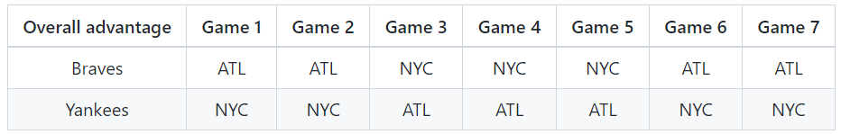
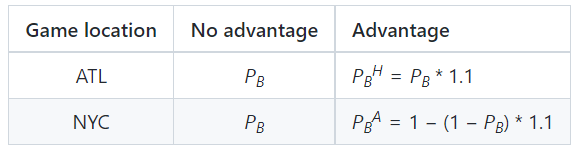

# Introduction

In this blog post, we'll be discussing the impact on winning the world series if home field advantage exists
by answering a series of questions using simulation and analytic probability calculations.
The home field advantage is the edge which a team may have when playing a game at its home stadium. For example, it is the edge the Braves may have over the Yankees when the head-to-head match-up is in Atlanta over New York and vice versa. The World Series is a first-to-4-wins match-up between the champions of the American and National Leagues of Major League Baseball. 

# Background

Suppose that the Braves and the Yankees are teams competing in the World Series.

The table below has the two possible schedules for each game of the series. (NYC = New York City, ATL = Atlanta)



Let PB be the probability that the Braves win a single head-to-head match-up with the Yankees, under the assumption that home field advantage doesn’t exist. Let PBH denote the probability that the Braves win a single head-to-head match-up with the Yankees as the home team (H for home). Let PBA denote the probability that the Braves win a single head-to-head match-up with the away team (A for away).



# Methodology

1) Compute analytically the probability that the Braves win the world series when the sequence of game locations is {NYC, NYC, ATL, ATL, ATL, NYC, NYC}. Calculate the probability with and without home field advantage when PB =0.55. What is the difference in probabilities?

```{r}
library(dplyr)
library(data.table)
# Get all possible outcomes
apo <- fread("./all-possible-world-series-outcomes.csv")

# Game Schedule - {NYC, NYC, ATL, ATL, ATL, NYC, NYC}
hfi <- c(0,0,1,1,1,0,0)

pb <- 0.55
advantage_multiplier <- 1.1
pbh <- 0.55*advantage_multiplier
pba <- 1 - (1 - 0.55)*advantage_multiplier

# Calculating the probability of each possible outcome
apo[, p := NA_real_] 
for(i in 1:nrow(apo)){
  prob_game <- rep(NA_real_, 7)
   for(j in 1:7){
     p_win <- ifelse(hfi[j], pbh, pba)
    prob_game[j] <- case_when(
        apo[i,j,with=FALSE] == "W" ~ p_win
      , apo[i,j,with=FALSE] == "L" ~ 1 - p_win
      , TRUE ~ 1
    )
  }
  apo[i, p := prod(prob_game)] 
}


# Probability of World Series Outcome with the Braves Winning
overall <- apo[, sum(p), overall_outcome]
(BravesHomeFieldAdvantage <- as.double(overall[overall_outcome == "W", 2]))
```

```{r}
(BravesNoHomefieldAdvantage = dnbinom(0,4,0.55) + dnbinom(1,4,0.55) + dnbinom(2,4,0.55) + dnbinom(3,4,0.55))
(Difference = BravesNoHomefieldAdvantage - BravesHomeFieldAdvantage)
```
The Braves have a Probability of 0.6042 of Winning the World Series with Home Field Advantage and 0.6082 without Home Field Advantage. The Braves are thus less likely by a Probability of 0.004 to win the World Series with Home Field Advantage. This is because the Schedule favors the Yankees by having 4 games in New York and only 3 in Atlanta. Thus the Braves are at a relative disadvantage as they are Away for the most part and take a hit in their win Probability. 

2) Calculate the same probabilities as the previous question by simulation.

```{r}
# one_rep <- function() {
# Game_State_BravesWin = sample(c("W", "W", "W", "W", "L","L","L"), 4)
# P <- .55 + .45*(Game_State_BravesWin == "L")
# result <- rbinom(7,4,P) %>% paste0(collapse = "")
# c(Game = Game_State_BravesWin, Result = result)
# }

```

3) What is the absolute and relative error for your simulation in the previous question?

p denotes the true underlying probability
pcap denotes the probability estimated from the simulation

absolute error = |pcap - p|

and

relative error = |pcap - p|/p

Our number of trials in an experiment (r) is fixed at 10000.

```{r}

```

4) Does the difference in probabilities (with vs without home field advantage) depend on PB? (Generate a plot to answer this question.)

```{r}
apo2 <- fread("./all-possible-world-series-outcomes.csv")
hfi <- c(0,0,1,1,1,0,0) #{NYC, NYC, ATL, ATL, ATL, NYC, NYC}

BravesHomeFieldAdvantageL = c()
pblist <- c(0.55, 0.6, 0.65, 0.7, 0.75, 0.8, 0.85, 0.9)
advantage_multiplier <- 1.1 # Set = 1 for no advantage
pbhlist <- pblist*advantage_multiplier
pbalist <- 1 - (1 - pblist)*advantage_multiplier

apo2[, p := NA_real_] 
for (k in 1:length(pblist))
{
  for(i in 1:nrow(apo2)){
  prob_gameL <- rep(NA_real_, 7)
   for(j in 1:7){
     p_winL <- ifelse(hfi[j], pbhlist[k], pbalist[k])
    prob_gameL[j] <- case_when(
        apo2[i,j,with=FALSE] == "W" ~ p_winL
      , apo2[i,j,with=FALSE] == "L" ~ 1 - p_winL
      , TRUE ~ 1
    )
  }
  apo2[i, p := prod(prob_gameL)] 
  }
  overall2 <- apo2[, sum(p), overall_outcome]
  BravesHomeFieldAdvantageL[k] <- as.double(overall2[overall_outcome == "W", 2])
}

BravesNoHomeFieldAdvantageL = c()
for (i in 1:length(pblist))
{
  BravesNoHomeFieldAdvantageL[i] = dnbinom(0,4,pblist[i]) + dnbinom(1,4,pblist[i]) + dnbinom(2,4,pblist[i]) + dnbinom(3,4,pblist[i])

}

DifferenceL = BravesHomeFieldAdvantageL - BravesNoHomeFieldAdvantageL 

BravesNoHomeFieldAdvantageL
BravesHomeFieldAdvantageL
DifferenceL

plot(pblist, DifferenceL, xlab = "Probability of Braves winning a head-to-head against the Yankees", ylab = "Diff. in Probabilities - With vs Without Home Field Adv." )


```
The difference in probabilities with and without home field advantages does depend on Pb but to a  minuscule degree. The relationship is small but measurable but not linear either as shown in the plot above where the difference is highest around 0.7 but lowest at 0.55 (it's lower than no Home field advantage at 0.55). The Braves do as mentioned in earlier have a significant disadvantage in their schedule as only 3 matches out of the 7 are played in Atlanta.


5) Does the difference in probabilities (with vs without home field advantage) depend on the advantage factor? (The advantage factor in PBH and PBA is the 1.1 multiplier that results in a 10% increase for the home team. Generate a plot to answer this question.)

```{r}
apo2 <- fread("./all-possible-world-series-outcomes.csv")
hfi <- c(0,0,1,1,1,0,0) #{NYC, NYC, ATL, ATL, ATL, NYC, NYC}

BravesHomeFieldAdvantageMult = c()
pb = 0.55
advantage_multiplierlist <- c(1,1, 1.2, 1.3, 1.4, 1.5, 1.6, 1.7, 1.8)
pbhlistadv <- pb*advantage_multiplierlist
pbalistadv <- 1 - (1 - pb)*advantage_multiplierlist

apo2[, p := NA_real_] 
for (k in 1:length(advantage_multiplierlist))
{
  for(i in 1:nrow(apo2)){
  prob_gameL <- rep(NA_real_, 7)
   for(j in 1:7){
     p_winL <- ifelse(hfi[j], pbhlistadv[k], pbalistadv[k])
    prob_gameL[j] <- case_when(
        apo2[i,j,with=FALSE] == "W" ~ p_winL
      , apo2[i,j,with=FALSE] == "L" ~ 1 - p_winL
      , TRUE ~ 1
    )
  }
  apo2[i, p := prod(prob_gameL)] 
  }
  overall2 <- apo2[, sum(p), overall_outcome]
  BravesHomeFieldAdvantageMult[k] <- as.double(overall2[overall_outcome == "W", 2])
}

BravesNoHomeFieldAdvantageSeries <- rep(BravesNoHomefieldAdvantage, length(advantage_multiplierlist))

options(scipen = 999)
DifferenceMult = BravesHomeFieldAdvantageMult - BravesNoHomeFieldAdvantageSeries 

BravesNoHomeFieldAdvantageSeries
BravesHomeFieldAdvantageMult
DifferenceMult

plot(advantage_multiplierlist, DifferenceMult, xlab = "Advantage Factor - Home vs Away", ylab = "Diff. in Prob. by Adv. Factor vs No Home Field Adv." )
```

The Difference in probabilities with and without home field advantages does depend on the advantage factor as shown in the plot above where we see a non linear but a decreasing trend till 1.6 from which there's an exponential increase in the difference in probability. In an absolute scale however, the difference is still relatively small. This is again due to the fact that the World Series schedule in consideration favors the Yankees, the probability of winning the New York games are greatly lowered for the Braves as the advantage factor increases. The graph would be inverted if the World Series schedule favored the Braves. 


